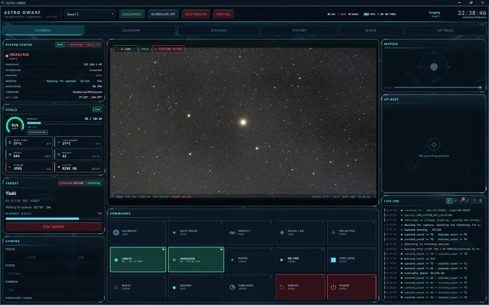

# Astro Dwarf

Tired of babysitting a Dwarf all night? Astro Dwarf is a desktop controller and unattended imaging scheduler for [Dwarf II](https://dwarflab.com/), Dwarf 3, and Dwarf Mini.

[Project site](https://styelz.github.io/astro_dwarf/) · [Download](https://github.com/styelz/astro_dwarf/releases/latest)

## What it does

- Schedule unattended deep-sky sessions on one or more telescopes
- Live Control HUD for preview, camera settings, commands, the queue, and the log
- Plan sessions by hand, from templates, from Stellarium, or from a Telescopius observing list
- Tele and wide cameras, mosaics, polar alignment, and Dual Lenses Locating
- Media album of sessions on the telescope, plus files already saved on this computer

Calendar, Sessions, History, Media, Sky, and Settings sit alongside Control.

<p align="center">
  <a href="https://styelz.github.io/astro_dwarf/#screens">
    
  </a>
</p>

<p align="center">
  <a href="https://styelz.github.io/astro_dwarf/#screens">Interactive slideshow on the project site</a>
  · Control · Calendar · Sessions · Media · Sky · Settings
</p>

## Download

Unsigned builds are on [GitHub Releases](https://github.com/styelz/astro_dwarf/releases/latest).

- **Windows:** run `AstroDwarf-Setup-*-win64.exe`. No admin password is required. If Windows shows a SmartScreen warning, choose **More info** → **Run anyway**. For a copy that does not need installing, unzip `AstroDwarf-*-win64-portable.zip` and run `AstroDwarf.exe`.
- **Mac (Apple Silicon):** open the `.dmg`, drag the app to Applications, then right-click it and choose **Open** the first time.
- **Linux:** use the `.AppImage`, or the package for your system (`.deb`, `.rpm`, or `.pkg.tar.zst`).

```bash
chmod +x AstroDwarf-*-linux-x86_64.AppImage
./AstroDwarf-*-linux-x86_64.AppImage
```

Set each telescope’s IP, model, and location in Settings. Start the scheduler from Control when you are ready to run the night.

## Run from source

Needs [Python 3.11+](https://www.python.org/downloads/) and Git.

```text
git clone https://github.com/styelz/astro_dwarf.git
cd astro_dwarf
./start.sh          # macOS / Linux
.\start.bat         # Windows
```

The first run creates a local environment and installs what it needs. Dwarf 3 and Mini live view also need `ffmpeg` on your PATH when you run from source (the installers already include it).

## Credits

Astro Dwarf is an unofficial third-party tool. It is not affiliated with, endorsed by, or supported by [DwarfLab](https://dwarflab.com/) or [Stellarium Labs](https://stellarium-labs.com/).

Sky targeting can use [Stellarium](https://stellarium.org/) desktop Remote Control, and the SKY page loads [Stellarium Web](https://stellarium-web.org/). Observing lists can be imported from a [Telescopius](https://telescopius.com/) CSV.

This project is licensed under the [MIT License](LICENSE).

Telescope commands come from [`dwarf_python_api`](https://github.com/stevejcl/dwarf_python_api) by [JC L. (`stevejcl`)](https://github.com/stevejcl).
